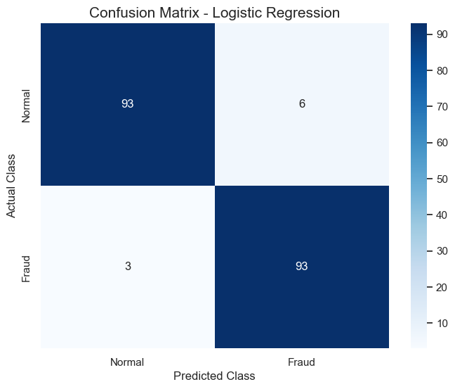
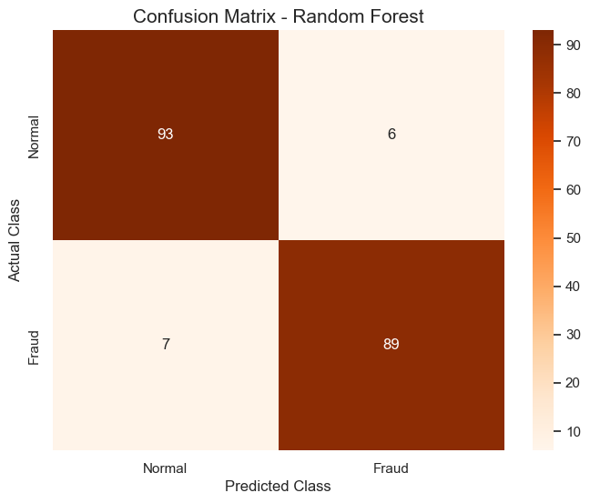
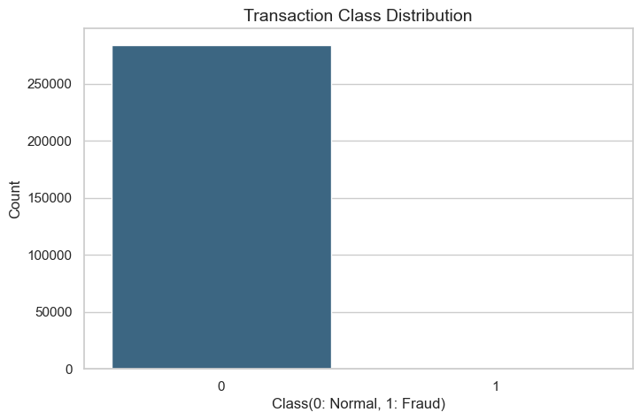
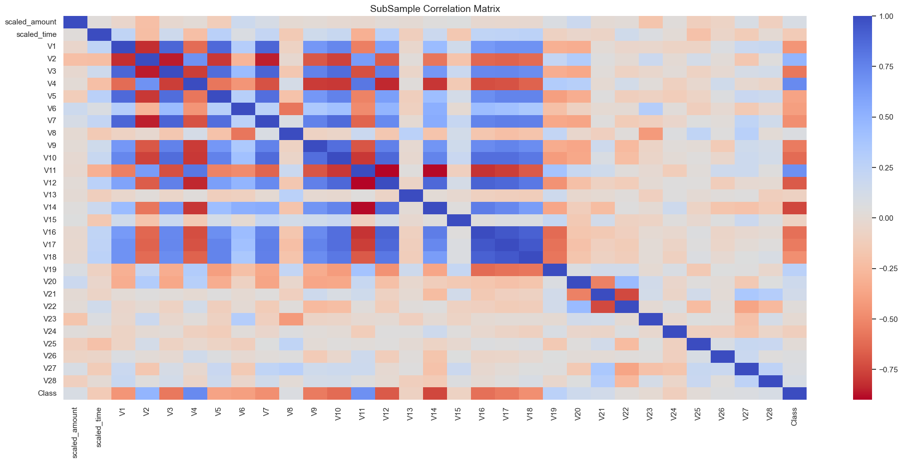
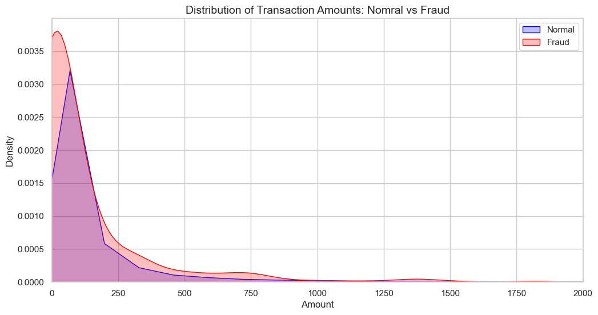

# Credit Card Fraud Detection with Machine Learning

**Data Source:** [Credit Card Fraud Detection on Kaggle](https://www.kaggle.com/datasets/mlg-ulb/creditcardfraud)

## 📍 Quick Navigation
* [Project Overview](#-project-overview)
* [Technical Challenges & Solutions](#️-technical-challenges--solutions)
* [Model Evaluation & Selection](#-model-evaluation--final-selection)
* [Exploratory Data Analysis (EDA)](#-exploratory-data-analysis-eda)
* [Dataset Information](#-dataset)
* [How to Run the API Locally](#️-how-to-run-the-api-locally)
* [How to Run with Docker](#-how-to-run-with-docker)
* [MLflow Experiment Tracking](#-mlflow-experiment-tracking)
* [Apache Airflow Orchestration](#-apache-airflow-orchestration)

---

```text
detection-fraud-machine-learning/
├── airflow/               # Apache Airflow core components
│   ├── dags/              # Automated orchestration scripts (DAGs)
│   ├── logs/              # Local execution history logs (Git-ignored)
│   └── plugins/
├── api/                   # FastAPI application layer
│   ├── main.py            # API routing and model inference logic
│   └── schemas.py         # Data validation contracts (Pydantic)
├── data/                  # Data directory (tracked by DVC)
│   ├── raw/               # creditcard.csv (Kaggle source dataset)
│   └── processed/
├── models/                # Trained model artifacts (tracked by DVC)
│   ├── logistic_regression_model.joblib
│   ├── random_forest_model.joblib
│   └── robust_scaler.joblib
├── notebooks/             # Exploratory Data Analysis & experiments
├── src/                   # Automation scripts
│   └── train.py           # Standardized model training & export script
├── .dockerignore          # Optimization build rules for container images
├── .env                   # Secure production environment variables (Git-ignored)
├── .gitignore             # Strict version control filter profile
├── Dockerfile             # Production Ubuntu-based container recipe
├── docker-compose.yaml    # Multi-container orchestration specification
├── dvc.yaml               # Directed Acyclic Graph (DAG) recipe for data/models
├── dvc.lock               # Deterministic pipeline execution tracking lockfile
├── params.yaml            # Standardized model and preprocessing hyperparameters
├── requirements.txt       # Pinned production dependencies
└── README.md
```

## 📌 Project Overview
This project aims to develop an AI model capable of identifying fraudulent credit card transactions. Using a real dataset (Kaggle), the main challenge is dealing with **extreme data imbalance**, where frauds represent a tiny fraction of total transactions.

## 🛠️ Technologies & Tools
* **Language:** Python 3.12
* **Libraries:** Pandas, NumPy, Scikit-Learn, Matplotlib, Seaborn
* **Algorithms:** Random Forest, Logistic Regression
* **Version Control:** Git, GitHub & DVC
* **Containerization:** Docker Desktop & WSL2 (Ubuntu 24.04)
* **Experiment Tracking:** MLflow
* **Workflow Orchestration:** Apache Airflow

## 🛠️ Technical Challenges & Solutions
Developing a fraud detection model requires a strategic approach to data preparation:

* **Extreme Class Imbalance:** Fraudulent transactions represented only 0.17% of the dataset. I implemented **Random Under-Sampling** to create a balanced 50/50 distribution.
* **Presence of Outliers:** Applied the **Interquartile Range (IQR) Method** to remove extreme values and **Robust Scaling** for features 'Amount' and 'Time'.
* **Model Selection:** While Random Forest is powerful, **Logistic Regression** proved superior in this specific scenario due to proper data cleaning.
* **Prioritizing Recall:** The project was optimized for **Recall**, achieving a 0.97 score, as missing a fraud is more costly than a false alarm.

## 📈 Project Status
- [x] Environment & Repository Setup
- [x] Exploratory Data Analysis (EDA)
- [x] Pre-processing & Cleaning
- [x] Model Training
- [x] Results Evaluation
- [x] RestApi (FastAPI)
- [x] Docker Containerization
- [x] DVC Data Versioning (Hyperparameters in `params.yaml`)
- [x] MLflow Experiment Tracking (Dual-Run Matrix Comparison)
- [ ] Apache Airflow Production DAG Automations

## 🏆 Model Evaluation & Final Selection
The project compared a linear baseline with a complex ensemble method. **Logistic Regression** emerged as the most effective model.

| Model | True Positives (Frauds Caught) | False Negatives (Missed Frauds) | Recall |
| :--- | :---: | :---: | :---: |
| **Logistic Regression** | **93** | **3** | **0.97** |
| Random Forest | 89 | 7 | 0.93 |

**Final Decision:** We selected **Logistic Regression** because it minimized the number of missed frauds (only 3 vs 7 from Random Forest).

### 📊 Results Visualization
#### **Winner: Logistic Regression Confusion Matrix**


#### **Runner-up: Random Forest Confusion Matrix**


## 🔍 Exploratory Data Analysis (EDA)
Insights gained during the initial analysis:

* **Data Imbalance**: Visualizing the 0.17% fraud gap.
  
* **Feature Correlation**: Identifying which PCA variables correlate most with fraud.
  
* **Distribution Patterns**: Analysis of transaction amounts and time density.
  

## 📊 Dataset
The dataset contains transactions made by European cardholders in September 2013. Due to its size (143MB), the CSV file is not included.

[Download Dataset from Kaggle](https://www.kaggle.com/datasets/mlg-ulb/creditcardfraud)

**Note:** Place the `creditcard.csv` file inside the `data/raw/` folder after downloading.

## ️⚙️ How to Run the API Locally

1. **Activate your virtual environment:**
   ```bash
   source .venv_wsl/bin/activate
   ```

2. **Start the Uvicorn server:**
   ```bash
   uvicorn api.main:app --reload
   ```

3. **Access Interactive Documentation:**
   Open your browser and navigate to `http://127.0.0` to test the `/predict` endpoint via Swagger UI.

## 🐳 How to Run with Docker

This project features a custom Ubuntu-based Dockerfile engineered to run smoothly on CPUs without AVX instructions by skipping heavy on-the-fly compilation.

1. **Build the Docker Image:**
   ```bash
   docker build -t fraud-api .
   ```

2. **Run the Container (Port Forwarding 8000):**
   ```bash
   docker run -d -p 8000:8000 --name fraud-detection-service fraud-api
   ```

3. **Verify Status:**
   Check your Docker Desktop application or visit `http://127.0.0` to execute real-time fraud scoring inside the container.

## 📉 MLflow Experiment Tracking

To launch the decoupled, resource-efficient local tracking dashboard server on the Windows host machine:

1. **Start MLflow Server (Windows Command Prompt):**
   ```cmd
   py -m mlflow server --backend-store-uri sqlite:///mlflow.db --host 0.0.0.0 --port 5000
   ```
2. **Access Dashboard:**
   Open `http://127.0.0.1:5000` to review runs, parameters (`max_iter`), model tracking artifacts, and metrics comparisons.

## 🌪️ Apache Airflow Orchestration

The full MLOps automation loop is orchestrated inside sandboxed isolated environments using Docker Compose containers:

1. **Provision Environment Infrastructure:**
   ```bash
   docker compose down -v && docker compose up -d
   ```
2. **Access Operations Dashboard:**
   Open `http://127.0.0.1:8082` inside your browser and authenticate using the configuration deployment user credentials (`admin` / `admin`).
